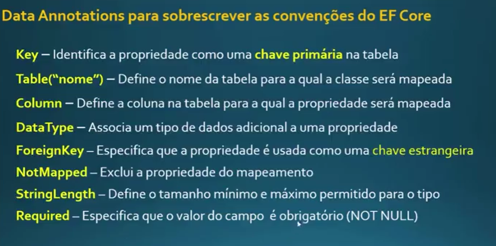

### Configurando projeto para usar o EF Core
Pomelo.EntityFrameworkCore.MySql
Microsoft.EntityFrameworkCore.Design

dotnet tool install --global dotnet-ef

dotnet tool update --global dotnet-ef


### Aplicar migrations
- Dentro da pasta do projeto

dotnet ef migrations add nomeDaMigracao
dotnet ef database update
dotnet ef database update 0 (voltar para migration inicial)

dotnet ef migrations remove




# Populando tabelas

1. Cria uma migration
2. Adiciona valores no up e down. Ex:
```C#
public partial class PopulaTabelas : Migration
{
    protected override void Up(MigrationBuilder migrationBuilder)
    {
        migrationBuilder.Sql("Insert into Categorias(Nome, ImagemUrl) Values('Bebidas','bebidas.jpg')");
    }

    protected override void Down(MigrationBuilder migrationBuilder)
    {
        migrationBuilder.Sql("Delete from Categorias");
    }
}
```
3. Aplica database

# Dicas para otimizar consultas em banco de dados
- Evite retornar todos os registros: utilize o método Take() para limitar o número de resultados.
- Filtre objetos relacionados: utilize o método Where() para evitar o carregamento de dados desnecessários.
- O método AsNoTracking() pode ser útil em cenários em que você não precisa atualizar ou salvar as entidades retornadas por uma consulta. Isso pode melhorar o desempenho da consulta, pois o Entity Framework não precisa gastar tempo acompanhando as alterações nas entidades.
    O método AsNoTracking() pode ser usado em diversas situações, como:
    - Ao recuperar dados para leitura apenas, como para exibir em uma página da web.
    - Ao realizar consultas agregadas, como contar o número de registros em uma tabela.
    -Ao recuperar dados de um banco de dados somente leitura.
